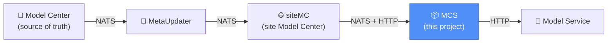

# MCS — Model Caching Service 📦

*A friendly introduction — for the deep technical detail, see the docs linked at the bottom.*

---

## What is MCS? 🤔

MCS (Model Caching Service) is a caching layer that sits between **Model Service** and **siteMC (site Model Center)**. Think of it like a CDN, but for ML model artifacts instead of web assets.

Without MCS, every Model Service instance has to reach all the way back to siteMC every time it needs a model, kernel, or package file. That's slow, and it puts a lot of load on siteMC when many Model Service instances ask for the same things.

MCS fixes this by keeping a local copy of everything Model Service commonly needs — model files, kernel code, packages, and metadata like version lists — right next to where it's needed. 🚀

---

## Where does MCS fit? 🗺️

- **Model Center** is where models actually get published — the ultimate source of truth.
- **MetaUpdater** bridges Model Center's messaging system to siteMC's.
- **siteMC** is the existing site-level model service Model Service has always talked to.
- **MCS** sits between siteMC and Model Service, quietly caching things so Model Service gets faster responses and siteMC gets less traffic.
- **Model Service** doesn't need to change how it talks to things — MCS's APIs are designed to be a **drop-in replacement** for what it already calls.

---

## What does MCS actually do? ⚙️

MCS runs as **3 containers working together** in every pod:

| Container | Job |
|---|---|
| 🎧 **synchronizer** | Listens for "something changed" messages from siteMC and downloads new/updated artifacts and metadata ahead of time |
| 🍽️ **mcs (serving)** | Answers Model Service's requests — serves from local cache when possible, falls back to siteMC when not |
| 🧹 **janitor** | Keeps disk usage under control by cleaning up old, rarely-used files when storage starts filling up |

Together, these three make sure Model Service almost always gets a **fast, local answer** instead of waiting on a round trip to siteMC.

---

## Why does this matter? 💡

- **⚡ Faster responses** — Model Service reads from local disk instead of the network most of the time
- **📉 Less load on siteMC** — fewer repeated requests for the same models/kernels/packages across every Model Service instance
- **🔒 Secure at rest** — cached model and kernel files are partially encrypted on disk, not sitting around in plaintext
- **🧹 Self-managing storage** — the janitor automatically evicts old files before disk fills up, no manual cleanup needed
- **🔌 No changes needed on Model Service's side** — MCS mirrors the same API contract Model Service already uses

---

## A quick glossary 📖

| Term | Meaning |
|---|---|
| **Model Center** | Where models are originally published |
| **siteMC (site Model Center)** | The existing site-level service Model Service has always talked to |
| **MetaUpdater** | Small bridge service relaying update events from Model Center to siteMC |
| **Model Service** | The consumer — the service that actually runs inference and needs model/kernel/package files |
| **Artifact** | A model file, kernel file, or package file — the actual bytes Model Service downloads |
| **Meta / Metadata** | Lists and version info — e.g. "which models are online for this function," "which kernel version is active" |
| **PVC** | The persistent disk each MCS pod uses to store cached artifacts |
| **NATS** | The messaging system MCS listens on to hear about new/updated artifacts and metadata |

---

## Ready to deploy? 🚀

Head to the deployment guide for step-by-step setup — Helm chart, Redis Sentinel, Vault secrets, and everything else needed to get MCS running.

---

*MCS — making Model Service faster and safer. 🎉*
